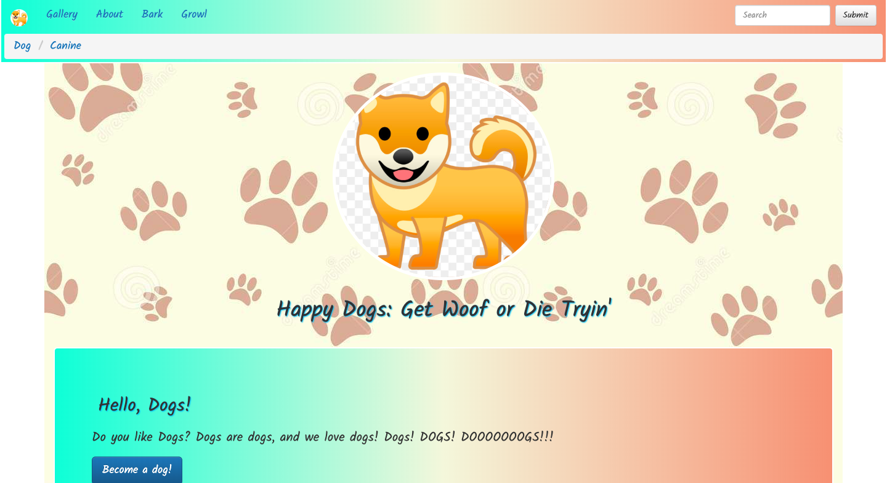
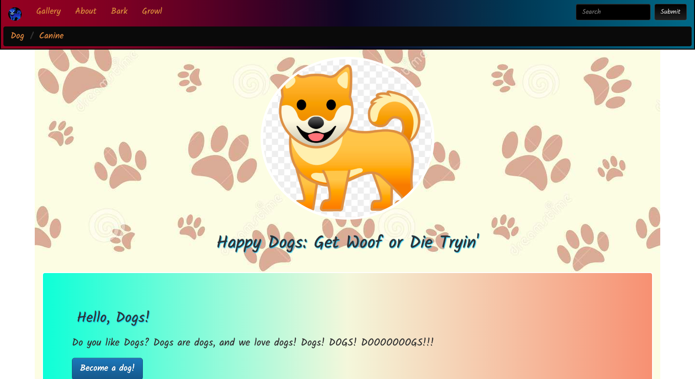
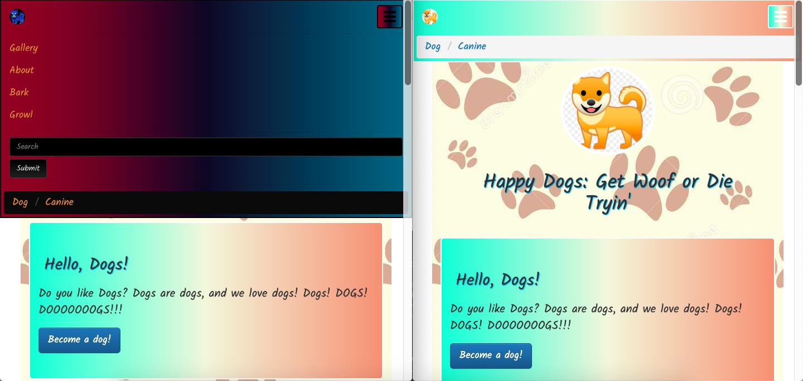
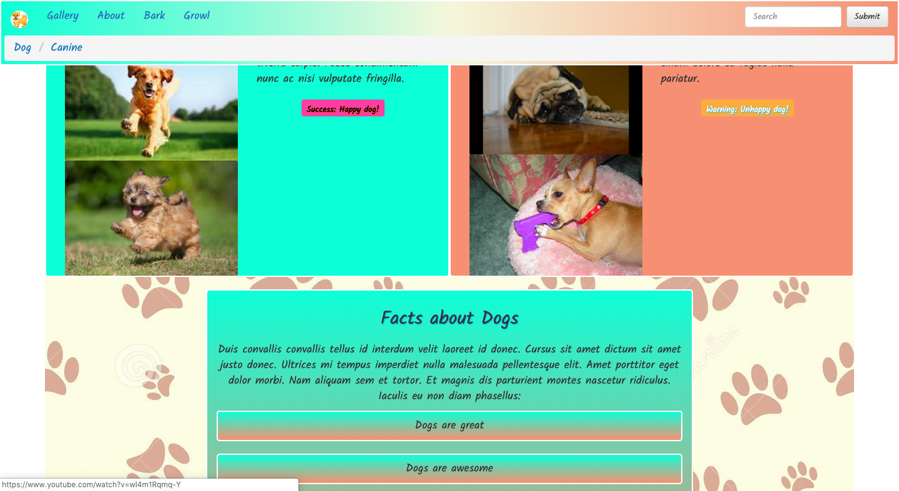
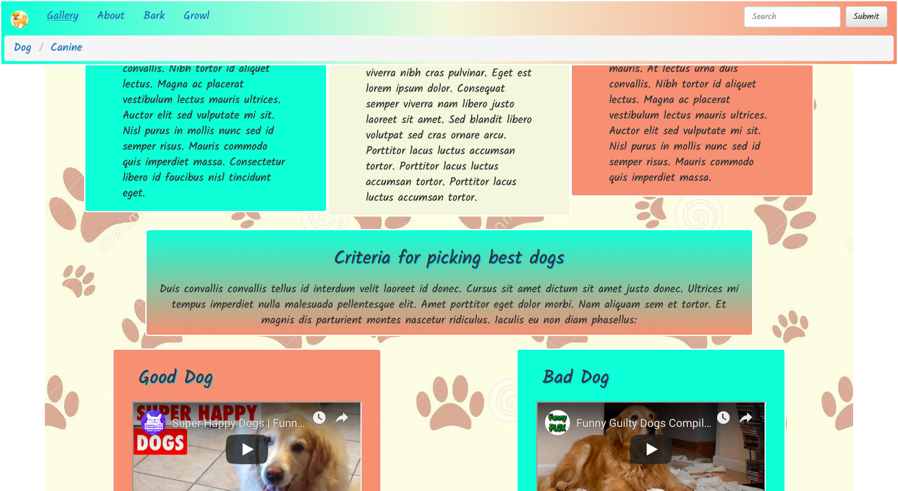
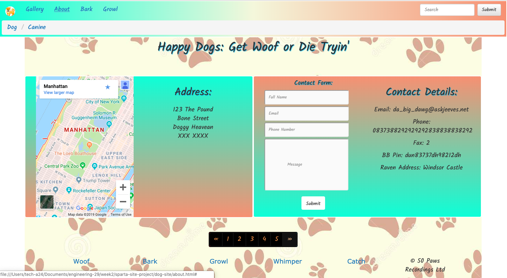

# sparta-site-project

## Sparta functional website project

HTML and CSS files for a functioning website, with all additional fonts, js and images attached.

Project specifications were to use Bootstrap to style a responsive and scalable website with functioning navbar and three pages.

The layout of the navbar and header was consistent across all pages:


The navbar has collapsable functionality while also having some other CSS styling applied, such as the use of `:hover` and the application of inversion, which can be seen in the image and code below. The page and navbar also scales correctly for all screen sizes as seen below:










**HTML**
```HTML
<div class="container-fluid top">
  <nav class="navbar nav-color navbar-fixed-top">
    <div class="container-fluid">
      <!-- Brand and toggle get grouped for better mobile display -->
      <div class="navbar-header">
        <button type="button" class="navbar-toggle collapsed nav-color" data-toggle="collapse" data-target="#bs-example-navbar-collapse-1">
          <span class="sr-only nav-color">Toggle navigation</span>
          <span class="icon-bar nav-color"></span>
          <span class="icon-bar nav-color"></span>
          <span class="icon-bar nav-color"></span>
        </button>
        <a class="navbar-brand" href="#"></a>
      </div>

      <!-- Collect the nav links, forms, and other content for toggling -->
      <div class="collapse navbar-collapse" id="bs-example-navbar-collapse-1">
        <ul class="nav navbar-nav">
          <li><a href="gallery.html">Gallery</a></li>
          <li><a href="about.html">About</a></li>
          <li><a href="#">Bark</a></li>
          <li><a href="#">Growl</a></li>
        </ul>
        <form class="navbar-form navbar-right">
          <div class="form-group">
            <input type="text" class="form-control" placeholder="Search">
          </div>
          <button type="submit" class="btn btn-default">Submit</button>
        </form>
        </ul>
      </div><!-- /.navbar-collapse -->
    </div><!-- /.container-fluid -->
    <ol class="breadcrumb">
      <li><a href="#">Dog</a></li>
      <li><a href="#">Canine</a></li>
    </ol>
  </nav>
```

**CSS**
```CSS
/* NAV STYLES */

.nav-color {
  background-image: linear-gradient(to right, aquamarine, beige, darksalmon);
  border: white 2px solid;
}

.nav-color2 {
  background-image: linear-gradient(to right, aquamarine, beige, darksalmon);
  border: white 2px solid;
}

.pag-nav, .pag-nav2 {
  text-align: center;
}

.pag-nav2 {
  display: block;
}

.jumbotron {
  text-align: left;
}

.breadcrumb {
  margin: 5px;
}

/* HOVER STYLES */

#logo1:hover, #logo2:hover, .nav-color:hover, .label-style:hover {
  filter: invert(100%);
}
```


The rest of the pages showed a variety of uses and implentation of the grid structure with differing sizes and elements applied to columns across the site. There were also some html elements added such as `<iframe>` and `<form><input>...</input></form>`, which can be seen below:








